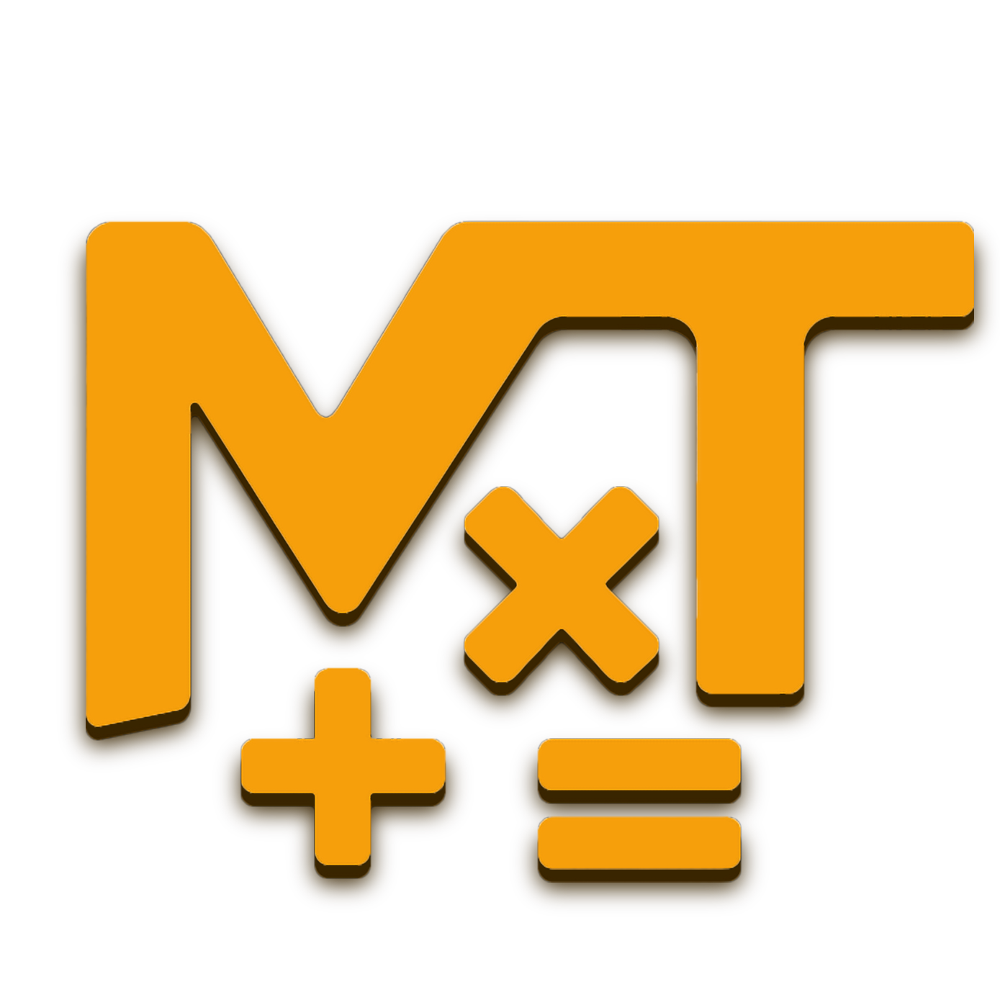

# MathTransformer

An app that turns plain English into solvable math. It parses a sentence, deduces the equation, solves it and returns the result.

👉 **Try it out:** <https://mathtransformer.app/>

  

## Features

- Natural language → equation (via a HuggingFace transformer)
- Equation → result (via Sympy)
- Clean JSON output accessible by API
- Minimal Gradio UI site with a dynamic interface, a custom logo & shareable previews
